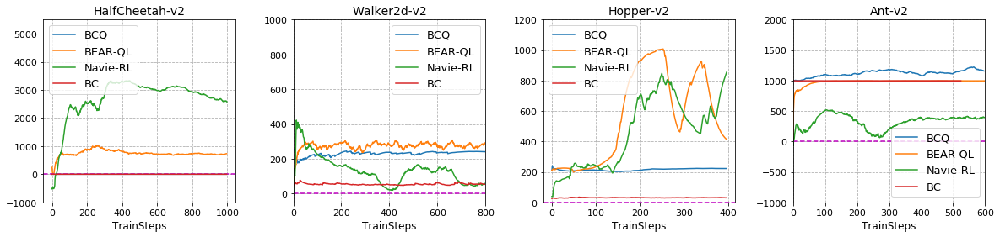

# BEAR-QL

This repository contains Tensorflow implementation of BEAR Q-Learning to reproduce the experiments described in the paper ["Stabilizing Off-Policy Q-Learning via Bootstrapping Error Reduction "](https://arxiv.org/abs/1906.00949) for NeurIPS 2019 Reproducibility Challenge (https://reproducibility-challenge.github.io/neurips2019/).

## Dependencies
- Python 3.6 or greater
- Tensorflow 1.14.0
- Numpy 1.17.3
- OpenAI Gym version 0.10.5
- Matplotlib
- Mujoco version 2.0 and mujoco_py-2.0.2.8

## Results
Below command reproduce experiments done in the paper (It assumes static dataset is in buffers/).
```
python main.py --game=Ant --version=v2 --it=1000000 --batch=256 --lr=1e-3 --sample_p=10 --sample=5 --eval_freq=1000 --buffer=buffer_filename
```
Args
```
-game, version : MuJoCo game environments
-it : iterations for training
-batch : batch size to sample batch from dataset
-lr : learning rate of optimizer
-sample_p : number of action samples for target Q
-sample : number of action samples for MMD
-eval_freq : evaluation interval
-buffer : name of buffer file
```
Below figures show the results of experiments with different datasets (Top:paper, Bottom:ours).

### Medium quality Dataset


### Random Dataset



### Optimal Dataset


